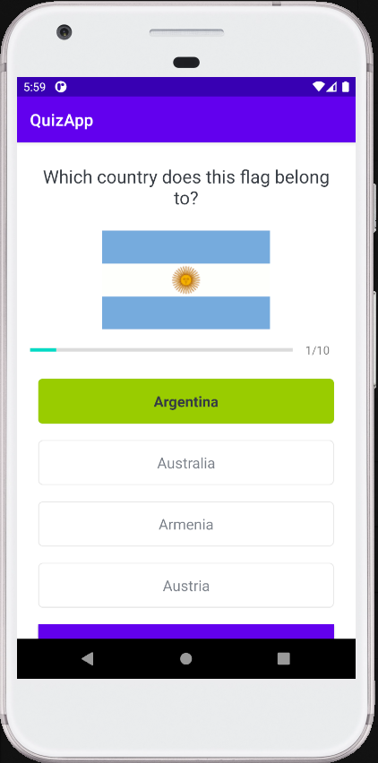

# QuizApp
Quiz app match country name to its flag.

<h3>User:</h3>

- is given four country names and must match flag to country name,
- before quiz user must submit player name,
- top scores are saved in db and displayed in leader board,
- game consists of 10 questions.

<h3>Used technologies:</h3>

- loading questions from csv file,
- sqlite for saving top scores,
- ArrayAdapter,
- finding views from layout with view binding.

<h3>App screenshots:</h3>

Login screen           |  Question screen
:-------------------------:|:-------------------------:
  |  

Results screen           |  Game summary screen
:-------------------------:|:-------------------------:
  |  
